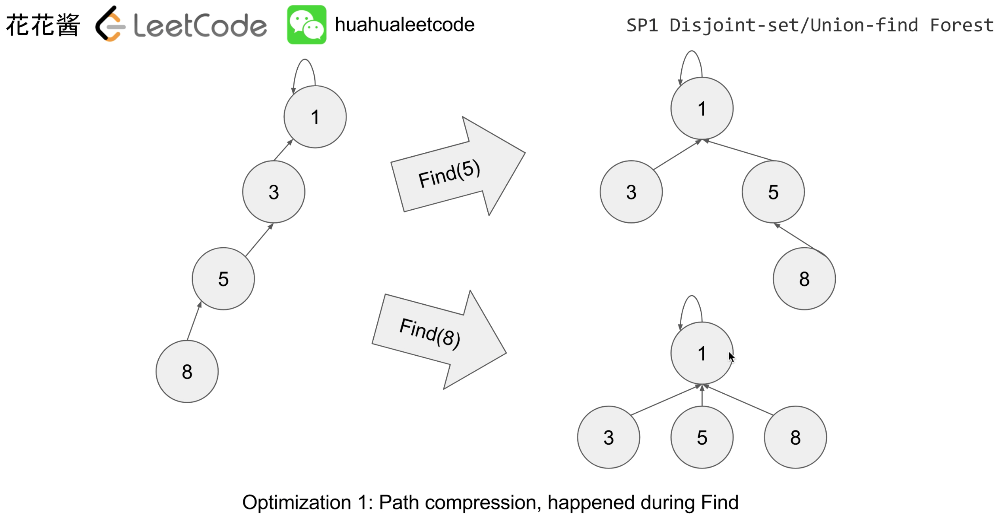
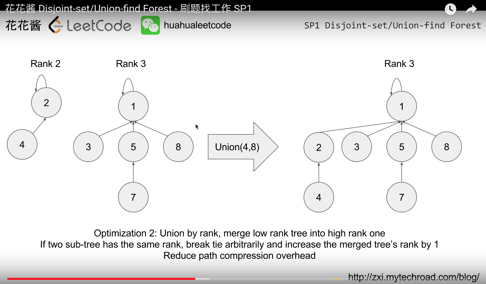

# Union Find Forest (Disjoint-Set)

Find(x): find the root/cluster-id of x.
Union(x, y): merge two clusters

Check whether TWO elements are in the same set or not in O(1)*

Find(8) = 1, Find(3) = 1, Find(1) = 1
```
 -> 1 <- 2 <- 3 <- 8
(1 points to itself)
```

Without optimization Find  = O(n)

### Optimization 
#### 1) Path compression: Make the flat tree, happening during FIND




#### 2) Union by Rank, merge low rank tree to high one
If two sub-tree has the same rank, break tie arbitrarity and increase the merged tree's rank by 1 
Reduce path compression overhead.




### Pesudo Code:

```c++
class UnionFindSet(n):
  parent = [1..n]
  ranks = [0..0] (n zeros)

  func Find(x):
    if x != parents[x]: // x 不是 root
      parents[x] = Find(parents[x])
    return parents[x]

  func Union(x, y):
    rootX, rootY = Find(x), Find(y)
    if rank[rootX] > rank[rootY]: parents[rootY] = rootX
    if rank[rootX] < rank[rootY]: parents[rootX] = rootY
    if ranks[rootX] == ranks[rootY]:
      parents[rootY] = rootX
      ranks[rootY]++
```

***
## Example

### 737 Sentence Similarity II


### 684 Redundant Connection

```java
class UnionFindSet {
  private int[] ranks;
  private int[] parents;
  public UnionFindSet(int n) {
      this.ranks = new int[n + 1];
      this.parents = new int[n + 1];
      for(int i = 0; i < n + 1; i++) {
          ranks[i] = 1;
          parents[i] = i;
      }    
  }
  
  public boolean Union(int u, int v) {
      int rootU = Find(u);
      int rootV = Find(v);
      
      if(rootU == rootV) return false;
      
      if(this.ranks[rootU] > this.ranks[rootV]) {
          this.parents[rootV] = rootU;
      } else if(this.ranks[rootU] < this.ranks[rootV]) {
          this.parents[rootU] = rootV;
      } else {
          parents[rootV] = rootU;
          this.ranks[rootU]++;
      }
      
      return true;
  }
  
  public int Find(int u) {
      while(this.parents[u] != u) {
          this.parents[u] = this.parents[this.parents[u]];
          u = this.parents[u];
      }
      return u;
  }
```


### 547 Friend Circles

***

[Source - 花花醬](https://www.youtube.com/watch?v=VJnUwsE4fWA)
[Union Find Algorithm](https://www.cs.princeton.edu/~rs/AlgsDS07/01UnionFind.pdf)